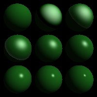

# OpenGL Ray Tracing
- run commands from script.exe: .exe file found in *x64\Debug\Assignment_4_win.exe*

eg. 
```cmd
x64\Debug\Assignment_4_win.exe -input .\data\scene01_plane.txt -size 200 200 -output .\image\scene_1.bmp
```

## Ray Intersection

### Sphere

I referenced a stackoverflow answer in order to extract `t` from the equation https://stackoverflow.com/questions/1986378/how-to-set-up-quadratic-equation-for-a-ray-sphere-intersection#:~:text=C%20%3D%20%5B(xo%20-%20a)

StackOverflow Answer:
Here's a detailed walkthrough of each step for getting intersection point; hopefully this will make things crystal clear. The equation for a three-dimensional sphere is:

`(x-a)^2 + (y-b)^2 + (z-c)^2 = r^2`

with `<a, b, c>` being the center of the sphere and `r` its radius. The point `<x, y, z>` is on the sphere if it satisfies this equation.

The parametric equations for a ray are:

*   `X = xo + xd*t`
*   `Y = yo + yd*t`
*   `Z = zo + zd*t`

where `<xo, yo, zo>` is the origin of the ray, and `<xd,yd,yd>` is camera ray's direction.

To find the intersection, we want to see what points on the ray are the same as points on the sphere. So we substitute the ray equation into the sphere equation:

`(xo + xd*t - a)^2 + (yo + yd*t - b)^2 + (zo + zd*t - c)^2 = r^2`

which expands to:

      (xd^2 + yd^2 + zd^2)                              * t^2 +
      [2[xd * (xo - a) + yd * (yo - b) + zd *(zo - c)]] * t   +
      [(xo - a)^2 + (yo - b)^2 + (zo - c^)2 - r^2]      * 1
      = 0
    

Notice that this is a quadratic equation in the form `At^2 + Bt + C = 0`, with:

*   `A = (xd^2 + yd^2 + zd^2)`
*   `B = [2[xd * (xo - a) + yd * (yo - b) + zd *(zo - c)]]`
*   `C = [(xo - a)^2 + (yo - b)^2 + (zo - c^)2 - r^2]`

We can apply the general quadratic formula for an unknown variable, which is:

    t = [-B +- sqrt(B^2 - 4AC)] / 2A
    

The `B^2 - 4AC` portion is called the "discriminant". Depending on the value of the discriminant, I will get zero, one, or two solutions to this equation:

*   If it is less than zero, the solution is an imaginary number, and the ray and sphere do not intersect in the real plane.
    
*   If it is equal to zero, then the ray intersects the sphere at exactly 1 point (it is exactly tangent to the sphere).
    
*   If it is greater than zero, then the ray intersects the sphere at exactly 2 points.
    

If the discriminant indicates that there's no solution, then you're done! The ray doesn't intersect the sphere. If the discriminant indicates at least one solution, you can solve for `t` to determine the intersection point. The two solutions are:

    t_1 = [-B + sqrt(B^2 - 4AC)] / 2A
    t_2 = [-B - sqrt(B^2 - 4AC)] / 2A
    

The smaller solution is the point at which the ray first hits the sphere.
_______________________________________________________________________________________________________________

Hence I constructed the function as such:

```cpp
virtual bool intersect( const Ray& r , Hit& h , float tmin)
    {   
        // new instance of origin
        vec3 origin = r.getOrigin() - this ->center;

        // solve quadratic equation || o + td - c || - r = 0 to find t
        const float a  = glm::dot(r.getDirection(),(r.getDirection()));
        const float b = 2.0 * glm::dot(r.getDirection(),(origin));
        const float c = glm::dot(origin, origin) - this->radius * this->radius;

        bool intersected = false;
        //check real root
        if (pow(b,2) - 4 * a * c >= 0)
        {
            float t1 = (-b + sqrt(pow(b,2) - 4 * a * c)) / (2 * a);
            float t2 = (-b - sqrt(pow(b,2) - 4 * a * c)) / (2 * a);
            if (t1 > tmin && t1 < h.getT())
            {
                h.set(t1, this->material, glm::normalize(r.pointAtParameter(t1) -this ->center));
                intersected = true;
            }
            if (t2 > tmin && t2 < h.getT())
            {
                h.set(t2, this->material, glm::normalize(r.pointAtParameter(t2) - this ->center));
                intersected = true;
            }
        }
        return intersected;

	}
```

### Plane
It is much simpler to find `'t'` for the plane as the equation of a plane is `n^t(o + td) + offset = 0`. This equation pluses the offset instead of minus since
```cpp
this->d = -d;
```
in Plane struct class
```cpp
Plane( const vec3& normal , float d , Material* m):Object3D(m)
    {
        this->normal = glm::normalize(normal);
        this->d = -d;
	}
``` 
 therefore `t = -(offset + n^t(o)) / n^t(d)`

```cpp
virtual bool intersect( const Ray& r , Hit& h , float tmin)
    {   

        vec3 origin = r.getOrigin();
        vec3 direction = r.getDirection();
        float t = -(this-> d + glm::dot(this-> normal, origin) ) / glm::dot(this-> normal, direction);
        if (t > tmin && t < h.getT())
        {
            h.set(t, this->material, this->normal);
            return true;
        }
        return false;
	}
```

### Triangle

In order to calculate the interpolated normal, I had to calculate the barycentric coordinates first, thus I was to calculate the areas accordingly to get area ABC, beta (`wb` from image) and gamma (`wc` from image). I calculated the determinant of `3x3` matrices, which is filled with each vector such as `(C-A)` and `(B-A)` to get its respective areas. The `1/2` will cancel out when divided with area of `ABC`. alpha (`wa`) is calculated using its inside condition `1 - beta - gamma` as shown below in the picture. I then solved for t using Cramer's rule.

![][image_ref_a32ff4ads]

```cpp
virtual bool intersect( const Ray& ray,  Hit& hit , float tmin)
    {
        vec3 origin = ray.getOrigin();
        vec3 direction = ray.getDirection();
        vec3 AX_edge = this->a - origin;
        vec3 AB_edge = this->a - this->b;
        vec3 AC_edge = this->a - this->c;

        //find alpha,beta,gamma using formula
        float area = glm::determinant(glm::mat3(AB_edge,AC_edge,direction));
        float beta = glm::determinant(glm::mat3(AX_edge,AC_edge,direction)) / area;
        float gamma = glm::determinant(glm::mat3(AB_edge,AX_edge,direction)) / area;
        float t = glm::determinant(glm::mat3(AB_edge,AC_edge,AX_edge)) / area;
        

        if (t > tmin && t < hit.getT() && beta + gamma <= 1.0f && beta >= 0.0f && gamma >= 0.0f)
        {   
            float alpha = 1.0f - beta - gamma;
            hit.set(t, this->material, glm::normalize(alpha *normals[0] + beta *normals[1] + gamma *normals[2]));

            return true;
        }

        return false;
    }
```
### Transform

I had to transform the ray origin and direction using the transformation matrix m by multiplying with the inverse of m. Then I generated a new Ray instance using the new origin and direction. If the new ray intersects with the object, then I would compute the new normal vector by multiplying the computed normal vector of the Hit with the transpose of the inverse m. Lastly, I updated the Hit with the new normal vector.

```cpp
virtual bool intersect( const Ray& r , Hit& h , float tmin)
    {   
        vec3 origin = r.getOrigin();
        vec3 direction = r.getDirection();
        glm:: mat4 inv = glm::inverse(this-> m);
        vec3 trans_origin = (inv * vec4(origin, 1.0f));
        vec3 trans_direction = (inv*vec4(direction,0.0f));
        Ray trans_ray = Ray(trans_origin, trans_direction);

        if (o->intersect(trans_ray, h, tmin)) {
          vec3 trans_normal = glm::normalize(glm::transpose(inv)*glm::vec4(h.getNormal(),0.0f));
          h.set(h.getT(), h.getMaterial(), trans_normal);
          return true;
        }
        return false;
    }
```
### Material

To add diffuse intensity a, I used the Phong equation `(n.l)` to get diffuse_intensity. If there is illumination (intensity> 0), then add the diffuse lighting to the shaded color by multiplying it with the material diffuse color and light source color. 

To add specular intesnity, I used the Phong equation `r = 2n(n.l)-l` to get reflect vector r & `(r.v)` to get specular_intensity. I also needed to reverse the ray direction `v` as it is in the opposite direction of the reflection direction. If there is illumination, add the specular lighting to the shaded color by raising the specular_intensity to the power of the shininess then multiply it with the material specular color and light source color using the Phong equation.


```cpp
    vec3 Shade( const Ray& ray, const Hit& hit, const vec3& dirToLight, const vec3& lightColor ) 
    {
        vec3 color = vec3(0,0,0);  //default color black
        vec3 normal = glm::normalize(hit.getNormal());

        float diffuse_intensity = glm::dot(dirToLight, normal);
        //check if no illumination
        if (diffuse_intensity > 0)
        {
            color += diffuse_intensity * lightColor * this->diffuseColor;
        }

        vec3 reflect =  2*glm::dot(dirToLight, normal)*normal - dirToLight;

        //direction of camera opposite ray
        float specular_intensity = glm::dot(glm::normalize(-ray.getDirection()), reflect);
        //check illumniation
        if (specular_intensity && diffuse_intensity > 0)
        {
            color += pow(specular_intensity, this->shininess) * lightColor * this->specularColor;
        }

        return color;
    }
```

## Screenshots of generated images

    

